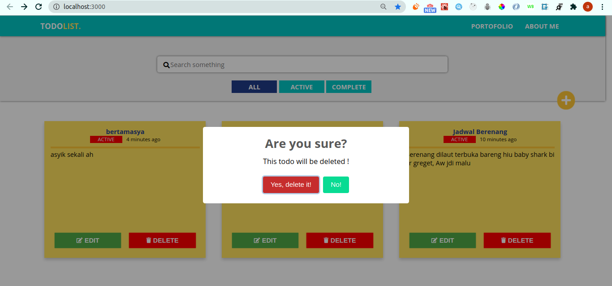
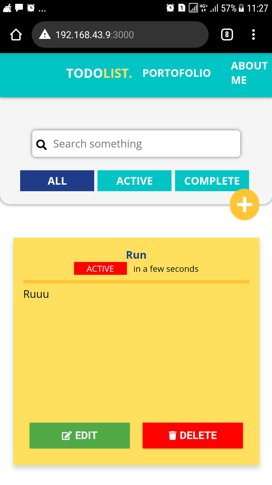
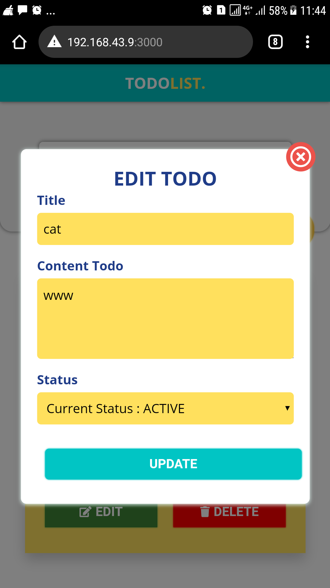
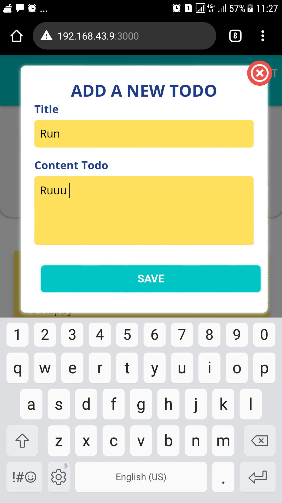
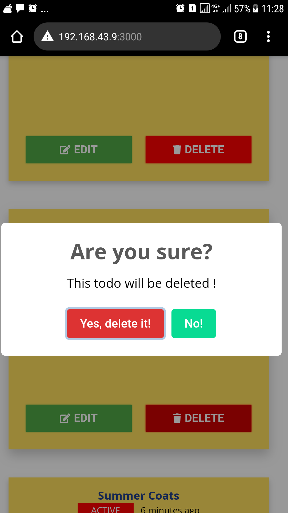

# Todo list documentation

### Stack I used in this project

| `Frontend`          | `Backend`   |
| ------------------- | ----------- |
| `ReactJs`           | `Mongoose`  |
| `React Redux`       | `ExpressJs` |
| `React Hooks`       |             |
| `SCSS Preprocessor` |             |

## Getting Started

Open this folder and install node modules in server and client folders

install node_modules on server folder, first of all make sure Mongodb already installed on your device.
If you don't have it, download and install from [mongodb documentation](https://docs.mongodb.com/manual/installation/)

```
$cd server
$npm install
```

run the server

```
$npm run dev

```

install node_modules on client folder

```
$cd client
$npm install / yarn install
```

run the todo apps

```
$npm start / yarn start
```

Application is running!

## DISPLAY

## First access display page and state is empty


## Click yellow button and modal will show up, you can add new todo here


## deleting todo with confirmation



## Edit and update todo


## Display in mobile





